# UI/UX Documentation

## Design System Specifications

### Brand Identity

- **App Name**: Gym Tracker
- **Tagline**: "Track, Progress, Achieve"
- **Mission**: Empowering users to plan, execute, and track workout sessions with a clean, minimal interface

### Color Palette

```css
/* Primary Colors */
--primary-50: #f0f9ff;
--primary-100: #e0f2fe;
--primary-500: #0ea5e9; /* Main brand color */
--primary-600: #0284c7;
--primary-700: #0369a1;
--primary-900: #0c4a6e;

/* Secondary Colors */
--secondary-50: #f8fafc;
--secondary-100: #f1f5f9;
--secondary-500: #64748b;
--secondary-600: #475569;
--secondary-900: #0f172a;

/* Semantic Colors */
--success-50: #f0fdf4;
--success-500: #22c55e;
--success-600: #16a34a;

--warning-50: #fffbeb;
--warning-500: #f59e0b;
--warning-600: #d97706;

--error-50: #fef2f2;
--error-500: #ef4444;
--error-600: #dc2626;

/* Neutral Colors */
--gray-50: #f9fafb;
--gray-100: #f3f4f6;
--gray-200: #e5e7eb;
--gray-300: #d1d5db;
--gray-400: #9ca3af;
--gray-500: #6b7280;
--gray-600: #4b5563;
--gray-700: #374151;
--gray-800: #1f2937;
--gray-900: #111827;
```

### Typography

```css
/* Font Family */
--font-sans: 'Inter', system-ui, -apple-system, sans-serif;
--font-mono: 'JetBrains Mono', monospace;

/* Font Sizes */
--text-xs: 0.75rem; /* 12px */
--text-sm: 0.875rem; /* 14px */
--text-base: 1rem; /* 16px */
--text-lg: 1.125rem; /* 18px */
--text-xl: 1.25rem; /* 20px */
--text-2xl: 1.5rem; /* 24px */
--text-3xl: 1.875rem; /* 30px */
--text-4xl: 2.25rem; /* 36px */

/* Font Weights */
--font-normal: 400;
--font-medium: 500;
--font-semibold: 600;
--font-bold: 700;

/* Line Heights */
--leading-tight: 1.25;
--leading-normal: 1.5;
--leading-relaxed: 1.75;
```

### Spacing Scale

```css
/* Spacing Units (based on 4px grid) */
--space-1: 0.25rem; /* 4px */
--space-2: 0.5rem; /* 8px */
--space-3: 0.75rem; /* 12px */
--space-4: 1rem; /* 16px */
--space-5: 1.25rem; /* 20px */
--space-6: 1.5rem; /* 24px */
--space-8: 2rem; /* 32px */
--space-10: 2.5rem; /* 40px */
--space-12: 3rem; /* 48px */
--space-16: 4rem; /* 64px */
--space-20: 5rem; /* 80px */
```

### Border Radius

```css
--radius-sm: 0.25rem; /* 4px */
--radius-md: 0.375rem; /* 6px */
--radius-lg: 0.5rem; /* 8px */
--radius-xl: 0.75rem; /* 12px */
--radius-2xl: 1rem; /* 16px */
--radius-full: 9999px;
```

### Shadows

```css
--shadow-sm: 0 1px 2px 0 rgb(0 0 0 / 0.05);
--shadow-md: 0 4px 6px -1px rgb(0 0 0 / 0.1);
--shadow-lg: 0 10px 15px -3px rgb(0 0 0 / 0.1);
--shadow-xl: 0 20px 25px -5px rgb(0 0 0 / 0.1);
```

## UI Component Guidelines

### Button Component

```typescript
// Button variants and sizes
type ButtonVariant = 'primary' | 'secondary' | 'outline' | 'ghost' | 'destructive';
type ButtonSize = 'xs' | 'sm' | 'md' | 'lg' | 'xl';

// Usage examples:
<Button variant="primary" size="md">Start Workout</Button>
<Button variant="outline" size="sm">Edit Routine</Button>
<Button variant="destructive" size="xs">Delete</Button>
```

**Button States:**

- Default: Standard appearance
- Hover: Slight color darkening + scale (1.02x)
- Active: Color darkening + scale (0.98x)
- Disabled: Reduced opacity (0.5) + no interactions
- Loading: Spinner + disabled state

### Card Component

```typescript
// Card variants for different content types
type CardVariant = 'default' | 'interactive' | 'highlighted' | 'workout';

// Exercise Card Example
<Card variant="interactive" className="exercise-card">
  <CardHeader>
    <CardTitle>Bench Press</CardTitle>
    <CardDescription>Chest, Triceps, Shoulders</CardDescription>
  </CardHeader>
  <CardContent>
    <div className="sets-display">3 sets × 8-10 reps</div>
    <div className="last-weight">Last: 185 lbs</div>
  </CardContent>
  <CardFooter>
    <Button size="sm">Start Exercise</Button>
  </CardFooter>
</Card>
```

### Form Components

```typescript
// Form field with validation
<FormField
  control={form.control}
  name="exerciseName"
  render={({ field }) => (
    <FormItem>
      <FormLabel>Exercise Name</FormLabel>
      <FormControl>
        <Input placeholder="Enter exercise name" {...field} />
      </FormControl>
      <FormDescription>Choose a descriptive name for your exercise</FormDescription>
      <FormMessage />
    </FormItem>
  )}
/>
```

### Navigation Components

```typescript
// Mobile-first navigation
<Navigation>
  <NavigationItem icon={<Home />} label="Dashboard" href="/dashboard" />
  <NavigationItem icon={<Calendar />} label="Routines" href="/routines" />
  <NavigationItem icon={<Activity />} label="Workout" href="/workout" active />
  <NavigationItem icon={<BarChart />} label="History" href="/history" />
  <NavigationItem icon={<User />} label="Profile" href="/profile" />
</Navigation>
```

## User Experience Flow Diagrams

### Authentication Flow

```mermaid
graph TD
    A[Landing Page] --> B{User Logged In?}
    B -->|No| C[Login/Register Options]
    B -->|Yes| D[Dashboard]
    C --> E[Login Form]
    C --> F[Register Form]
    E --> G{Valid Credentials?}
    F --> H{Valid Data?}
    G -->|Yes| D
    G -->|No| I[Error Message]
    H -->|Yes| J[Email Verification]
    H -->|No| K[Validation Errors]
    J --> L[Verify Email]
    L --> D
    I --> E
    K --> F
```



### Routine Planning Flow


### Workout Session Flow


## Responsive Design Requirements

### Breakpoints

```css
/* Mobile First Approach */
--breakpoint-sm: 640px; /* Small devices */
--breakpoint-md: 768px; /* Medium devices */
--breakpoint-lg: 1024px; /* Large devices */
--breakpoint-xl: 1280px; /* Extra large devices */
--breakpoint-2xl: 1536px; /* 2X large devices */
```

### Layout Patterns

#### Mobile Layout (< 768px)

- **Navigation**: Bottom tab bar with 5 main sections
- **Content**: Single column, full-width cards
- **Spacing**: Reduced padding and margins
- **Touch Targets**: Minimum 44px × 44px
- **Typography**: Smaller font sizes, tighter line heights

#### Tablet Layout (768px - 1023px)

- **Navigation**: Side drawer + bottom tabs
- **Content**: Two-column grid where appropriate
- **Spacing**: Increased padding and margins
- **Touch Targets**: Minimum 44px × 44px
- **Typography**: Medium font sizes

#### Desktop Layout (≥ 1024px)

- **Navigation**: Permanent sidebar navigation
- **Content**: Multi-column layouts, expanded cards
- **Spacing**: Full spacing scale
- **Interactions**: Hover states, tooltips
- **Typography**: Full font scale

### Component Responsiveness

#### Cards

- **Mobile**: Full width, minimal padding
- **Tablet**: 2-3 cards per row
- **Desktop**: 3-4 cards per row with hover effects

#### Forms

- **Mobile**: Stacked form fields, full-width inputs
- **Tablet**: 2-column layout for related fields
- **Desktop**: Optimized field grouping, inline validation

#### Navigation

- **Mobile**: Bottom tab bar (5 items max)
- **Tablet**: Collapsible sidebar + bottom tabs
- **Desktop**: Expanded sidebar with sub-navigation

## Accessibility Standards

### WCAG 2.1 AA Compliance

- **Color Contrast**: Minimum 4.5:1 for normal text, 3:1 for large text
- **Focus Indicators**: Visible focus rings on all interactive elements
- **Keyboard Navigation**: Full keyboard accessibility
- **Screen Readers**: Semantic HTML, ARIA labels, and descriptions
- **Alternative Text**: Descriptive alt text for all images

### Interactive Element Requirements

```typescript
// Focus management
<Button
  aria-label="Start workout session"
  onKeyDown={handleKeyPress}
  tabIndex={0}
>
  Start Workout
</Button>

// Loading states
<Button disabled aria-busy="true">
  <Spinner className="mr-2" />
  Saving...
</Button>

// Error states
<Input
  aria-invalid={hasError}
  aria-describedby="error-message"
/>
<div id="error-message" role="alert">
  Please enter a valid exercise name
</div>
```

### Color and Contrast

- **Text on Light Backgrounds**: Use gray-900 (#111827)
- **Text on Dark Backgrounds**: Use gray-50 (#f9fafb)
- **Interactive Elements**: Ensure 3:1 contrast minimum
- **Error States**: Use semantic error colors with sufficient contrast

## Animation and Micro-interactions

### Animation Principles

- **Duration**: 150-300ms for UI transitions
- **Easing**: `ease-out` for entrances, `ease-in` for exits
- **Reduced Motion**: Respect `prefers-reduced-motion` setting
- **Performance**: Use `transform` and `opacity` properties

### Micro-interactions

```typescript
// Button hover animation
const buttonVariants = {
  hover: {
    scale: 1.02,
    transition: { duration: 0.15, ease: 'easeOut' },
  },
  tap: {
    scale: 0.98,
    transition: { duration: 0.1, ease: 'easeIn' },
  },
};

// Card entrance animation
const cardVariants = {
  hidden: { opacity: 0, y: 20 },
  visible: {
    opacity: 1,
    y: 0,
    transition: { duration: 0.3, ease: 'easeOut' },
  },
};

// Loading spinner
const spinnerVariants = {
  animate: {
    rotate: 360,
    transition: { duration: 1, ease: 'linear', repeat: Infinity },
  },
};
```

### Page Transitions

- **Route Changes**: 200ms fade transition
- **Modal/Dialog**: Scale + fade animation (300ms)
- **Slide Panels**: Slide from edge (250ms)
- **Tab Switching**: Horizontal slide (200ms)

## Component Library Organization

### Shadcn UI Base Components

- Button, Input, Label, Textarea
- Card, Dialog, Sheet, Popover
- Select, Combobox, Dropdown Menu
- Table, Tabs, Calendar
- Toast, Alert, Badge
- Progress, Skeleton, Separator

### Custom Components

- ExerciseCard, RoutineCard, WorkoutCard
- WeeklyPlanner, DragDropExercise
- RestTimer, ProgressIndicator
- LastWeightDisplay, SetTracker
- WorkoutSummary, HistoryChart

### Layout Components

- PageHeader, Navigation, Sidebar
- AuthGuard, LoadingBoundary
- ErrorBoundary, EmptyState

## User Journey Maps

### New User Onboarding

1. **Discovery**: Landing page with clear value proposition
2. **Registration**: Simple sign-up form with email verification
3. **Profile Setup**: Basic information and fitness goals
4. **First Routine**: Guided routine creation with templates
5. **First Workout**: Walk-through of workout session features
6. **Progress Review**: Introduction to history and analytics

### Daily User Flow

1. **Dashboard Entry**: Quick overview of today's plan
2. **Routine Review**: Check scheduled exercises and last weights
3. **Workout Session**: Execute workout with real-time logging
4. **Progress Tracking**: Review completed session and progress
5. **Planning**: Adjust future routines based on performance

### Power User Flow

1. **Advanced Planning**: Create complex routines with variations
2. **Performance Analysis**: Deep dive into progress analytics
3. **Template Creation**: Build shareable routine templates
4. **Goal Setting**: Set and track specific fitness goals
5. **Data Export**: Export data for external analysis

## Design Tokens Integration

### CSS Custom Properties

```css
:root {
  /* Design tokens as CSS variables */
  --color-primary: var(--primary-500);
  --color-secondary: var(--secondary-500);
  --space-component-padding: var(--space-4);
  --border-radius-component: var(--radius-lg);
  --font-size-body: var(--text-base);
  --font-weight-heading: var(--font-semibold);
  --transition-duration: 200ms;
  --transition-timing: ease-out;
}
```

### Theme Configuration

```typescript
// Tailwind theme extension
module.exports = {
  theme: {
    extend: {
      colors: {
        primary: 'var(--primary-500)',
        secondary: 'var(--secondary-500)',
        // ... other color tokens
      },
      spacing: {
        component: 'var(--space-component-padding)',
        // ... other spacing tokens
      },
      transitionDuration: {
        default: 'var(--transition-duration)',
      },
    },
  },
};
```

This comprehensive UI/UX documentation ensures consistency across the Gym Tracker application while providing clear guidelines for designers and developers to create an intuitive, accessible, and engaging user experience.
